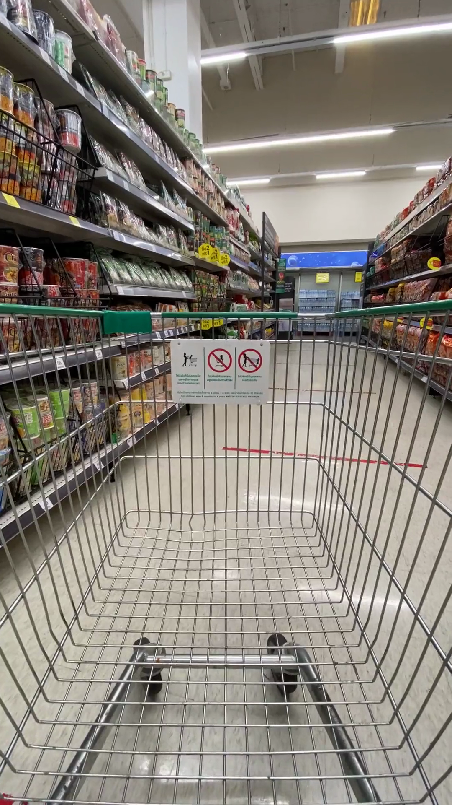
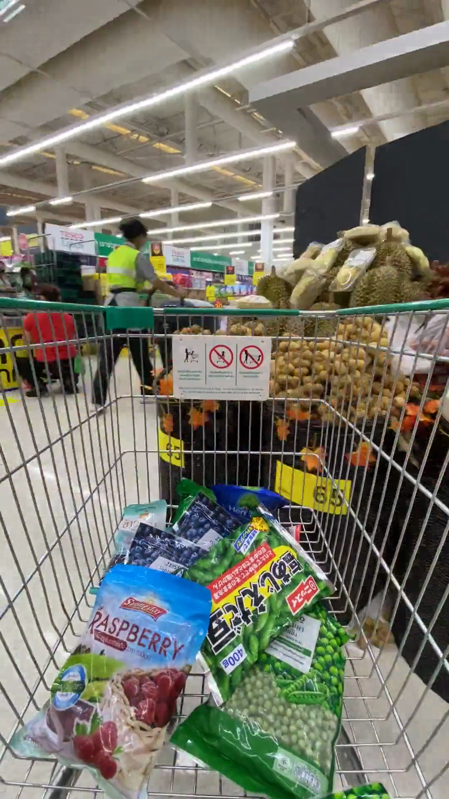
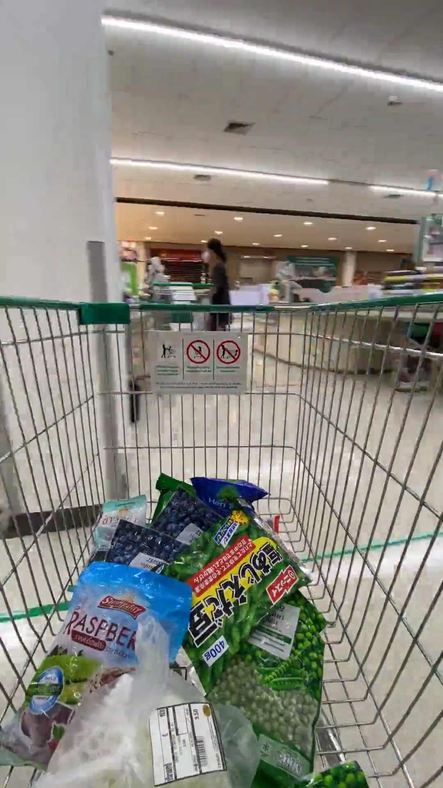
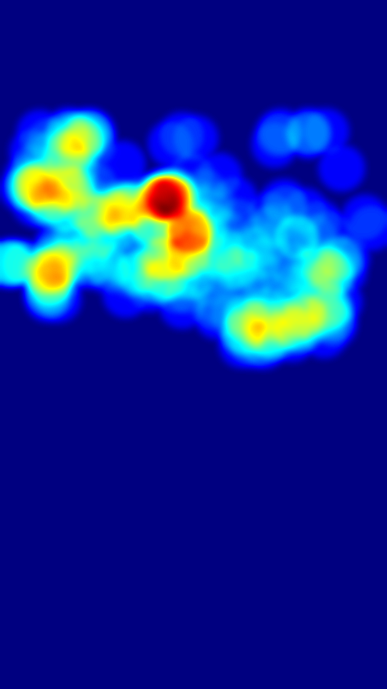
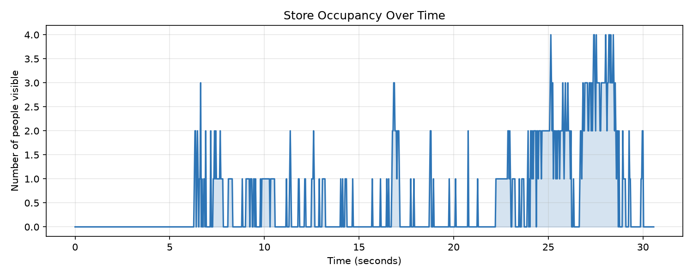

# 🛒 Retail Customer Intelligence
**YOLO Session — Project 4 | Business Analytics & Store Insights**

A real-time computer vision system that analyses supermarket footage and gives store managers actionable insights — who's in the store, where they go, how long they stay, and which areas get the most traffic. Built with a pretrained YOLO model and ByteTrack. No custom training.

---

## 📸 Screenshots

| Early frames | Mid video | Late video |
|:---:|:---:|:---:|
|  |  |  |

---

## 🔥 Zone Heatmap



Blue = low traffic · Red = highest traffic. Clear hotspot centre-left, matching CENTER being the most visited zone.

---

## 📈 Store Occupancy Over Time



Quiet for the first 6 seconds. Clearly busiest in the final 8 seconds, peaking at 4 people around 25s and 27–28s.

---

## ⚙️ How It Works

```
Video input
    ↓
YOLO detection (class 0 = person only)
    ↓
ByteTrack — assigns stable IDs across frames
    ↓
Zone classification — LEFT / CENTER / RIGHT
    ↓
Per-frame metrics — occupancy, dwell time, entry/exit, heatmap
    ↓
Live dashboard overlay + annotated video saved to disk
```

---

## 🚀 Setup & Run

**Install dependencies:**
```bash
pip install ultralytics opencv-python numpy matplotlib
```

**Run:**
```bash
cd retail_folder
python main.py
```

A live preview window opens. When finished, these files are saved:
- `output_annotated.mp4` — full annotated video
- `zone_heatmap.png` — standalone heatmap
- `occupancy_over_time.png` — occupancy graph

---

## 🗂️ File Structure

```
retail_folder/
├── main.py                       # Full pipeline
├── custom_tracker.yaml           # Tuned ByteTrack config
├── Retail_Project_Writeup.docx   # Full written explanation
├── zone_heatmap.png              # Heatmap output
├── occupancy_over_time.png       # Occupancy graph
└── assets/                       # Images for this README
    ├── screen_early.png
    ├── screen_mid.png
    ├── screen_late.png
    ├── zone_heatmap.png
    └── occupancy_over_time.png
```

---

## 🎨 Key Design Decisions

### Zones — why camera-relative?

The footage is from a moving cart, not fixed CCTV. Fixed pixel zones can't represent real store locations when the camera moves. Zones are defined relative to the camera's view:

```python
cart_cutoff_y = int(frame_height * 0.55)  # bottom 45% = cart, excluded
zone_left_x   = int(frame_width  * 0.30)  # left 30%   = LEFT zone
zone_right_x  = int(frame_width  * 0.70)  # right 30%  = RIGHT zone
                                           # middle 40% = CENTER zone
```

### Tracker Tuning

Default ByteTrack gave 44 unique track IDs for a clip where at most 4 people were visible. Fixed with a custom config:

```yaml
track_buffer: 60        # doubled from default ~30 frames
track_high_thresh: 0.25
match_thresh: 0.8
fuse_score: True
```

Also lowered detection confidence from `0.4` → `0.3`.

**Result:** avg dwell improved 0.6s → 0.9s · longest track 3.2s → 7.5s

### Business Health Score

```
Health Score = (Occupancy × 0.5) + (Dwell × 0.3) + (Zone Balance × 0.2)
```

| Component | Weight | Benchmark |
|---|---|---|
| Occupancy | 50% | 5 people at once = fully busy |
| Dwell time | 30% | 3 seconds = good engagement |
| Zone balance | 20% | Even split across LEFT/CENTER/RIGHT |

Occupancy weighted highest — foot traffic is the first thing a manager asks about.

---

## 📊 Final Results

```
Video:            30 seconds · 918 frames · 30fps · 1080×1920
Peak occupancy:   4 people at once
Zone visitors:    LEFT 18 · CENTER 28 · RIGHT 18
Zone ranking:     CENTER > LEFT = RIGHT
Avg dwell time:   0.9 seconds
Entry events:     53
Exit events:      52
Busiest period:   ~22–30 seconds
Health Score:     65 / 100
  ├── Occupancy:    80 / 100
  ├── Dwell:        31 / 100
  └── Zone balance: 78 / 100
```

---

## ⚠️ Known Limitations

| Limitation | Reason |
|---|---|
| Zones are camera-relative, not real store locations | Moving cart — fixed zones don't map to fixed physical spots |
| Unique visitor counts inflated | ByteTrack loses people and assigns new IDs on re-detection |
| Dwell times understated | Same reason — track fragments counted separately |
| Some people missed | yolo26n is the lightest model — small/distant people sometimes dropped |
| Entry/exit counts approximate | Track appearance/disappearance used as proxy, not real boundary |

---

## 🔒 Privacy Note

Movement patterns are personal data even without names. A real deployment needs clear signage at the store entrance, strict data retention limits, and no combining with loyalty card or payment data without explicit consent.

---

## 📄 Full Documentation

Every design decision — zone choice, dwell time logic, tracker tuning, health score formula, business insights, and honest limitations — is explained in `Retail_Project_Writeup.docx`.

---

*YOLO Session AI Project Brief — Project 4: Retail Customer Intelligence. Pretrained models only, no custom training.*